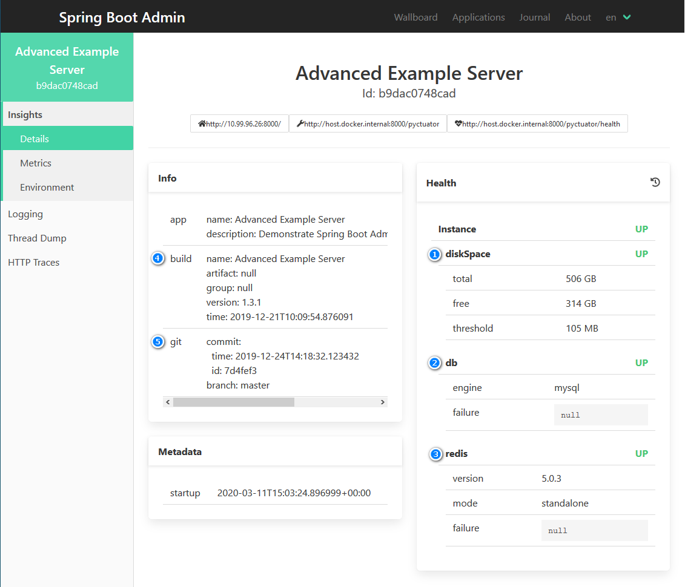
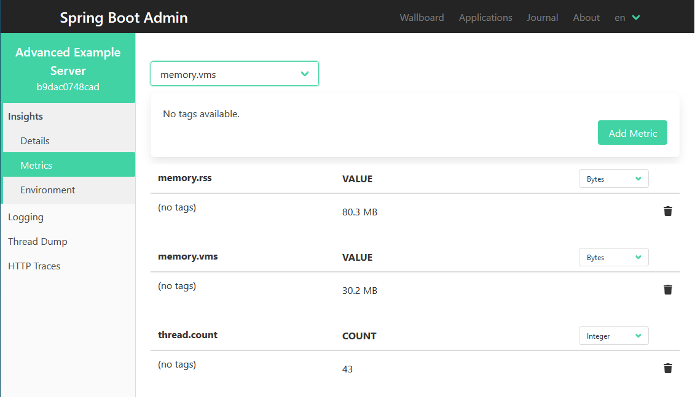
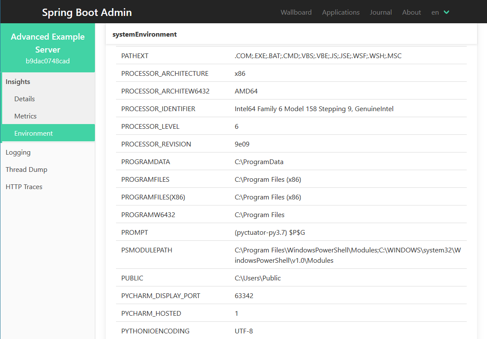
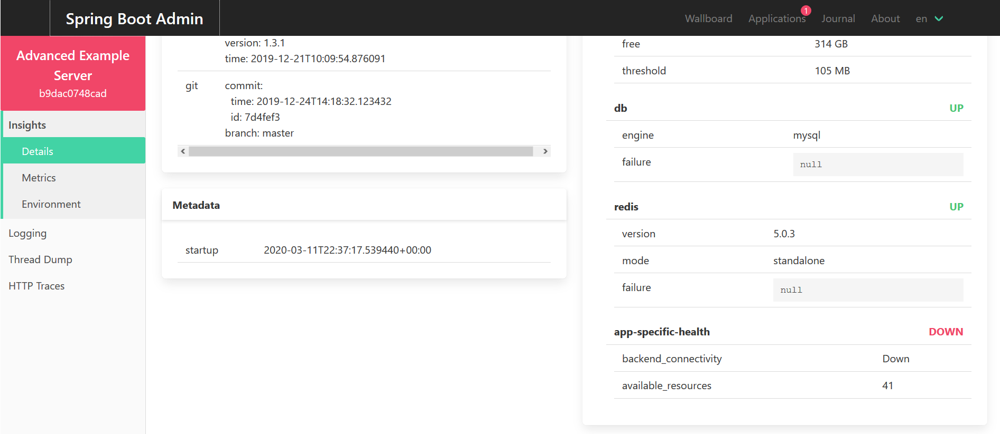

# Advanced Example
This example demonstrates using the optional features and customizations Pyctuator is offering.

## Running the example
Before running this example, you'll need SBA (Spring Boot Admin), MySQL and Redis running on the same machine the example application will be running. 

It is recommended to start these services using the `docker-compose.yml` part of this example, from the `examples/Advanced` directory perform:
```shell
docker-compose --project-name example --file docker-compose.yml up --detach --force-recreate
```  

Next, from the `examples/Advanced` directory, run the example application using poetry as follows:
```shell
poetry install
poetry run python advanced_example_app.py
```

# Using the example
The example application, available from http://localhost:8000 exposes example APIs for accessing the DB and Redis:
* http://localhost/db/version - returns the DB's version
* http://localhost:8000/redis/a-key - returns the value of the `a-key` key in redis

Connect to Spring Boot Admin using http://localhost:8082.
 
## Insights Details

1. Monitor disk space (requires [psutil](https://pypi.org/project/psutil/)):
2. Monitor connection to the DB (requies [sqlalchemy](https://pypi.org/project/SQLAlchemy/) and drivers specific to the DB being used)
3. Monitor Redis client (requires [redis](https://pypi.org/project/redis/))
4. Show build details
5. Show Git details

## Insights Metrics
If [psutil](https://pypi.org/project/psutil/) is installed, Pyctuator provides various process metrics in the "Metrics" tab:


## Insights Environment
Pyctuator automatically exposes all environment variables, after scrubbing secrets, via the "Environment" tab under "systemEnvironment":


Additionally, Pyctuator can be configured to expose application-specific configuration via SBA (after scrubbing commonly identified secrets):

Note that SBA only support flattened configuration hierarchy, which is automatically handled by Pyctuator.

# Further customization
Using Pyctuator, it is possible to have SBA monitor application-specific health aspects using custom health-providers. 

Health status may include multiple checks and may also include details on failures or the apps health.

To demonstrate this, the example application exposes additional API for setting the health, http://localhost:8000/health - posting a JSON formatted `pyctuator.health_provider.HealthDetails` to set the current health status.


For example, the call bellow will make the application report its down.
```shell
curl -X POST localhost:8000/health -d '{"status": "DOWN", "details": {"backend_connectivity": "Down", "available_resources": 41}}'
```

