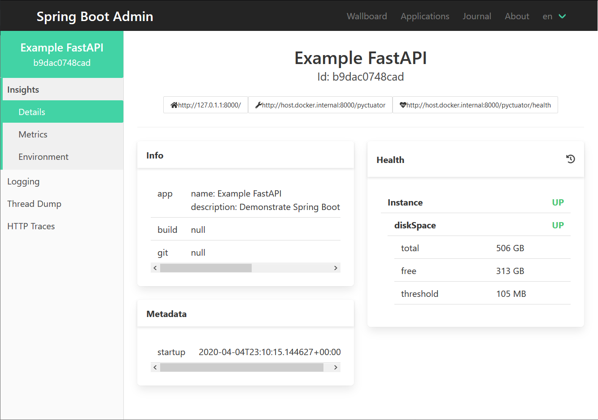

# FastAPI example
This example demonstrates the integration with the [FastAPI](https://fastapi.tiangolo.com/) web-framework.

## Running the example
1. Start an instance of SBA (Spring Boot Admin):
    ```sh
    docker run --rm -p 8080:8080 michayaak/spring-boot-admin:2.2.3-1
    ```
2. Once Spring Boot Admin is running, you can run the examples as follow:
    ```sh
    cd examples/FastAPI
    poetry install
    poetry run python -m fastapi_example_app
    ``` 



## Running an example where pyctuator requires authentication
In order to protect the Pyctuator endpoint, a customizer is used to make the required configuration changes to the API router. 
In addition, the credentials need to be included in the registration request sent to SBA in order for it it could authenticate when querying the pyctuator API.