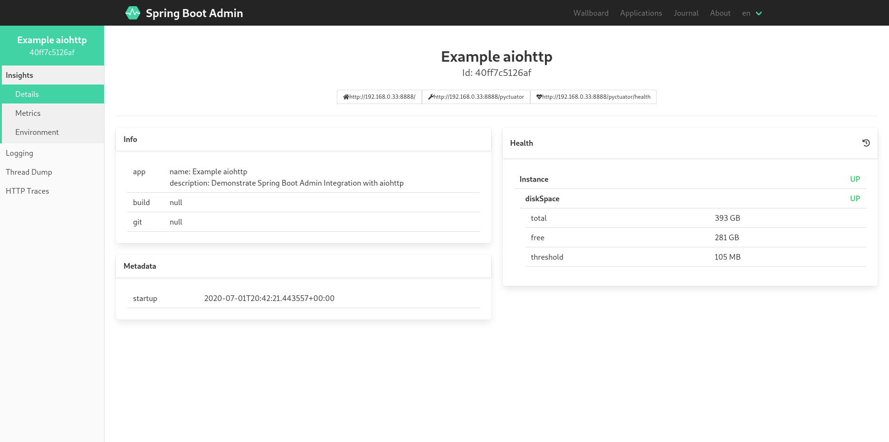

# aiohttp example
This example demonstrates the integration with the [aiohttp](https://flask.palletsprojects.com/).

## Running the example
1. Start an instance of SBA (Spring Boot Admin):
    ```sh
    docker run -p 8082:8082 --rm michayaak/spring-boot-admin:2.2.2
    ```
2. Once Spring Boot Admin is running, you can run the examples as follow:
    ```sh
    cd examples/aiohttp
    poetry install
    poetry run python -m aiohttp_example_app
    ``` 



