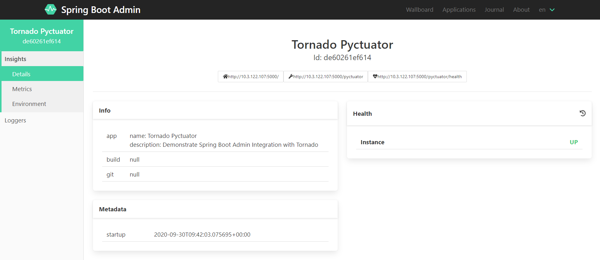

# Tornado example
This example demonstrates the integration with the [Tornado](https://www.tornadoweb.org/).

## Running the example
1. Start an instance of SBA (Spring Boot Admin):
    ```sh
    docker run --rm -p 8080:8080 --add-host=host.docker.internal:host-gateway michayaak/spring-boot-admin:2.2.3-1
    ```
2. Once Spring Boot Admin is running, you can run the examples as follow:
    ```sh
    cd examples/tornado
    poetry install
    poetry run python -m tornado_example_app
    ``` 



